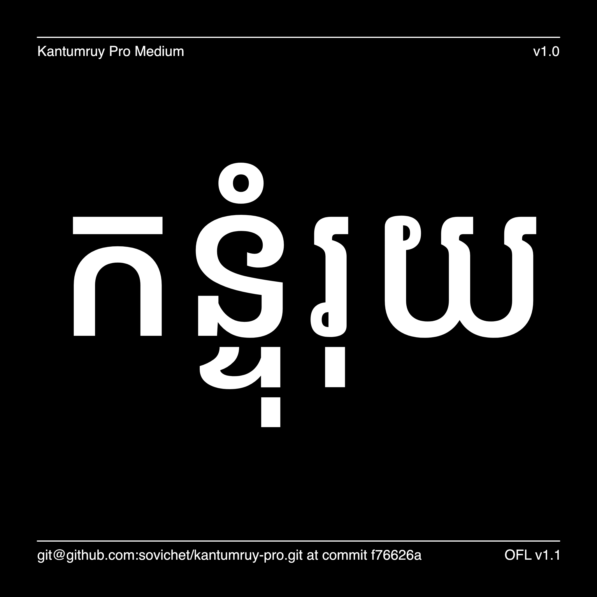

# Kantumruy Pro

[![][Fontbakery]](https://sovichet.github.io/kantumruy-pro/fontbakery-report.html)
[![][Universal]](https://sovichet.github.io/kantumruy-pro/fontbakery-report.html)
[![][GF Profile]](https://sovichet.github.io/kantumruy-pro/fontbakery-report.html)
[![][Outline Correctness]](https://sovichet.github.io/kantumruy-pro/fontbakery-report.html)
[![][Shaping]](https://sovichet.github.io/kantumruy-pro/fontbakery-report.html)

[Fontbakery]: https://img.shields.io/endpoint?url=https%3A%2F%2Fraw.githubusercontent.com%2Fsovichet%2Fkantumruy-pro%2Fgh-pages%2Fbadges%2Foverall.json
[GF Profile]: https://img.shields.io/endpoint?url=https%3A%2F%2Fraw.githubusercontent.com%2Fsovichet%2Fkantumruy-pro%2Fgh-pages%2Fbadges%2FGoogleFonts.json
[Outline Correctness]: https://img.shields.io/endpoint?url=https%3A%2F%2Fraw.githubusercontent.com%2Fsovichet%2Fkantumruy-pro%2Fgh-pages%2Fbadges%2FOutlineCorrectnessChecks.json
[Shaping]: https://img.shields.io/endpoint?url=https%3A%2F%2Fraw.githubusercontent.com%2Fsovichet%2Fkantumruy-pro%2Fgh-pages%2Fbadges%2FShapingChecks.json
[Universal]: https://img.shields.io/endpoint?url=https%3A%2F%2Fraw.githubusercontent.com%2Fsovichet%2Fkantumruy-pro%2Fgh-pages%2Fbadges%2FUniversal.json

Kantumruy Pro is a newly redrawn design of the first Kantumruy (published in 2013) which is a modern display Khmer typeface that is used by small and big brands in Cambodia as well as many non-profit organizations for their brand identity. In the new version, the design direction mostly remains the same, however, there are major changes in vertical metrics and proportions, some letterforms, and the Italic set is also included.

This update is made possible with the funding from Google Fonts and continuos support from Dave Crossland and the team at Google Fonts.

## About

Kantumruy Pro is designed by Sovichet Tep, a type director and co-founder of Anagata Design, an independent design studio specializes in identity design and typeface design, based in Phnom Penh, Cambodia. Sovichet has started designing type in 2011 as a hobby and turned into a professional career from 2018.

## Building

Fonts are built automatically by GitHub Actions - take a look in the "Actions" tab for the latest build.

If you want to build fonts manually on your own computer:

* `make build` will produce font files.
* `make test` will run [FontBakery](https://github.com/googlefonts/fontbakery)'s quality assurance tests.
* `make proof` will generate HTML proof files.

The proof files and QA tests are also available automatically via GitHub Actions - look at https://sovichet.github.io/kantumruy-pro.git.

## Changelog

**19 April 2022. Version 1.000**
- Initial release of the redrawn Kantumruy typeface.
- Work Sans is the Latin counterpart in the meantime.

## License

This Font Software is licensed under the SIL Open Font License, Version 1.1.
This license is copied below, and is also available with a FAQ at
https://scripts.sil.org/OFL

## Repository Layout

This font repository structure is inspired by [Unified Font Repository v0.3](https://github.com/unified-font-repository/Unified-Font-Repository), modified for the Google Fonts workflow.
